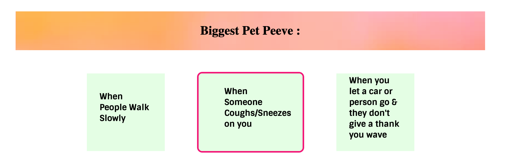
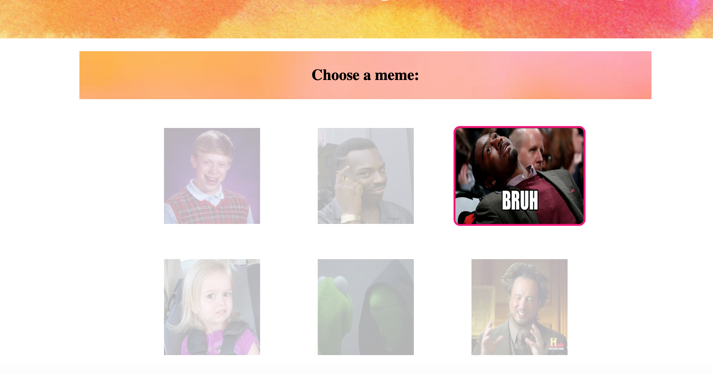
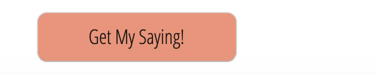
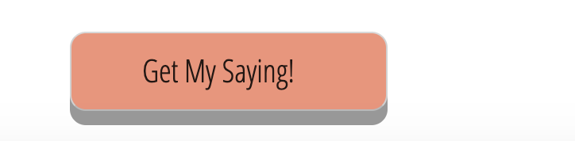
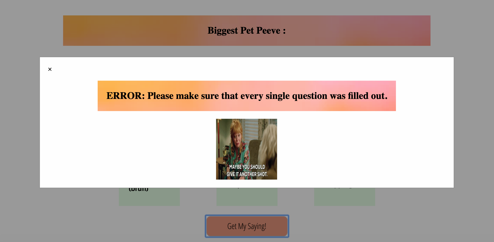
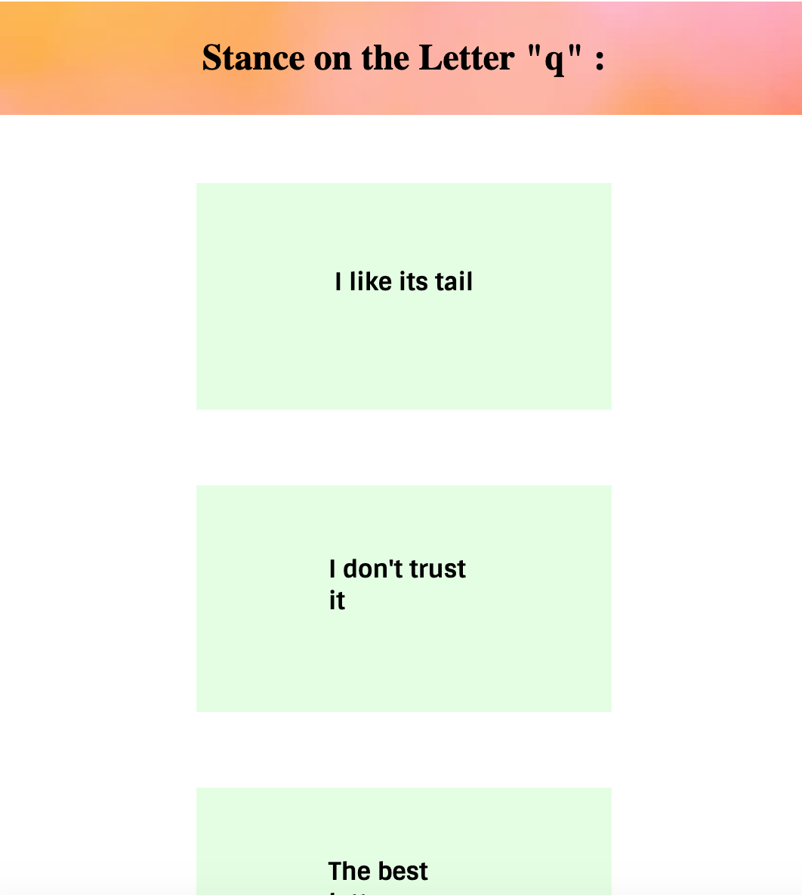

# Lab 2: Buzzfeed Style Quiz
## Bailey Burke
## CS 52 Spring 2019

### Description 

For this lab, I created a buzzfeed style quiz that will tell you what your new go-to word/phrase should be. I have 6 questions with 6 answers each, and each input (for each answer) has a value (1-6) associated with it. When the button at the bottom of the quiz is clicked on, it will either produce a modal that displays an error if not all questions were filled out, or will give you your word/saying. The phrase is calculated based on which value appeared the most in the javascript array. I made two loops- the first one counts the frequencies of each value based on how many times each value was clicked, and makes an array of that data. The second one loops through the frequency array and updates a variable that lets us know which value (and ultimately phrase) was associated with the highest frequency. I chose to do option 2, which was the styling option, and my hovers all have effects on them, as do the clicks. When you hover over the answer boxes, they are animated so that they expand outwards and a border is added on to it. When you hover over the button to submit, a box shadow is added and an animation occurs in which the text gets pushed to the side, which gives a 3d type effect. When the answer boxes are clicked, in addition to the opacity changes, an animation occurs so that the space around the selected answer grows. When the submit button is clicked, there is a bounce-in transition for the modal box. The modal box then displays an image or gif with the calculated word. Lastly, it also is responsive for smaller screens as well as mobile devices. 

### What worked

* The use of flex boxes made the alterations for responsive design less complex
* It was easier to format and style the page for this lab

### What did not work 

* It took a while for me to figure out all of the different jquery functions/syntax
* At first I weighted each answer value, and was going to produce output based on summing up the answer choice values, but ultimately decided to do the most common answer choice. 

### Screenshots of things to point out

This shows that when you hover over an answer, it expands and a border is added:

This shows that when you select an answer, the opacity changes and there is more area around the selected answer: 

This shows the normal bottom button: 

And this shows the button on a hover (text is moved over but it's hard to tell here:

This shows the modal after the bounce-in effect:

And this shows the mobile responsive design:

